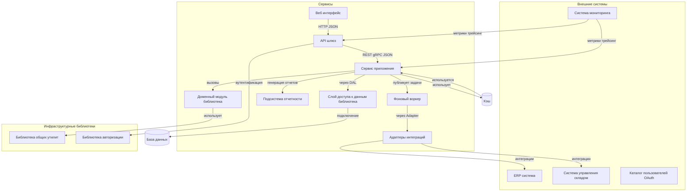
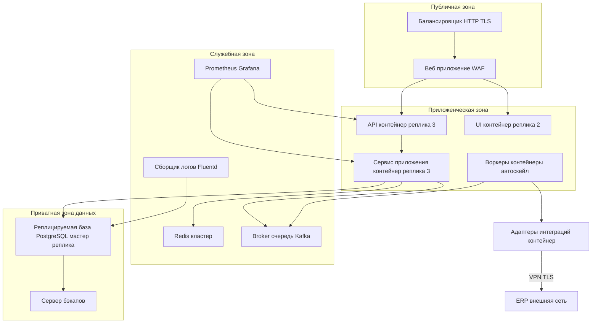

## 1. Таблица компонентов и ответственности

| Компонент | Ответственность | Что не делает | Тип |
|---|---:|---|---|
| API шлюз | Прием внешних запросов авторизация маршрутизация rate limiting | Бизнес логику и доступ к данным | Сервис |
| Веб интерфейс | Отображение UI работа с пользователем | Бизнес логику кроме презентации | Сервис |
| Сервис приложения | Бизнес логика оркестрация вызовов домена | Хранение сырой данных вне БД | Сервис |
| Доменный модуль | Правила предметной области в памяти | Интеграции с внешними системами | Библиотека |
| Слой доступа к данным | Транзакции запросы к БД маппинг сущностей | Бизнес правила | Библиотека |
| Фоновый воркер | Асинхронные задачи ETL обработка интеграций | Синхронные HTTP ответы клиентам | Сервис |
| Адаптеры интеграций | Подключение к ERP WMS трансформация данных | Бизнес логику сервиса приложения | Сервис |
| Подсистема отчетности | Генерация экспортов отчетов агрегация | Онлайн транзакции | Сервис |
| Библиотека авторизации | JWT управление ролями проверка прав | Хранение пользователей | Библиотека |
| Библиотека общих утилит | Логирование форматирование ответов | Бизнес правила | Библиотека |

## 2. Интерфейсы компонентов и контракты

| Интерфейс | Формат данных | Код ошибок единый контракт | Версионирование |
|---|---:|---|---|
| API REST | JSON RFC 8259 | { code число message строка details объект } HTTP статусы | URL /v{major}/ ресурс; мажорная несовместимость |
| Внутренний gRPC | Protobuf | status код metadata | Сема версионирование protobuf пакетов |
| Очередь сообщений | JSON с envelope полями: type payload metadata | Обработчик возвращает статус ACK NACK | Версия в заголовке сообщения |
| DB доступ | SQL возвращает сущности JSON | Ошибки переводятся в коды DAL_ | Контракты схемы в миграциях с версией |

Правило версионирования интерфейсов: несовместимые изменения мажорный номер и поддержка старой версии не меньше одного релиза клиента.

## 3. Диаграмма компонент

## 4. Внешние зависимости и интеграции

| Система | Протокол | Тип интеграции | Устойчивость при сбое |
|---|---:|---:|---|
| ERP | SOAP либо REST | Асинхронная через очередь с ретраями | Ретрies экспоненциальные dead letter очередь |
| WMS | REST webhook | Асинхронная push pull | Буферизация сообщений локально в очереди |
| Каталог пользователей | OAuth 2.0 | Синхронная авторизация | Кэш токенов и fallback read only |
| Система мониторинга | Prometheus | Сбор метрик pull | Локальное агрегирование при потере связи |

Выбор асинхронности для интеграций с возможными задержками и важностью устойчивости.

## 5. Диаграмма развертывания

Указаны TLS на балансировщике ролевые сети и приватная зона для БД доступ только с App Node и Adapter при необходимости.

## 6. Оценки ресурсов и сетевые зоны

| Узел | CPU RAM хранение | Причина |
|---|---:|---|
| API контейнер реплика | 2 vCPU 2 GiB | высокая сеть низкая логика |
| App сервис | 4 vCPU 8 GiB | бизнес логика CPU память |
| Воркеры | 2 vCPU 4 GiB | параллельная обработка задач |
| БД мастер | 8 vCPU 32 GiB SSD | транзакции индексы |
| Redis кластер | 3 узла 2 vCPU 4 GiB | быстрый кеш и сессии |
| Kafka | 3 брокера HDD 500 GiB | гарантированная доставка |

Сетевые зоны: публичная зона для балансировщика и WAF прикрытая зона приложения и приватная зона для данных. Правило доступов: least privilege межзоновые ACL.

## 7. Окружения и конфигурации

| Окружение | Назначение | Отличия |
|---|---:|---|
| dev | разработка локальная | малые ресурсы настройки дебага автообновление |
| test | интеграционное тестирование | данные тестовые CI деплой автоматический |
| staging | приемочное тестирование | конфигурации как в prod данные маскировка |
| prod | боевой | высокие ресурсы мониторинг и бэкапы |

Параметры конфигурации: адреса сервисов строки подключения таймауты feature flags ограничения ресурсов. Передача конфигурации через хранилище конфигов и переменные окружения, шаблоны Helm для Kubernetes.

Управление секретами: централизованное хранилище секретов с доступом по RBAC Vault или cloud KMS. Секреты не в репозитории. Ротация секретов не реже чем 90 дней и при увольнении.

Сертификаты TLS через ACME или корпоративный PKI автоматическое обновление и мониторинг срока действия.

## 8. Наблюдаемость и эксплуатация

Логи: структурированные JSON логи уровня info error debug где необходимо. Собираются Fluentd в центральный ELK стек с хранением 30 дней горячих 365 дней холодных.

Метрики: бизнес и технические метрики экспортируются в Prometheus агрегация в Grafana. Трассировки: распределенный трейсинг OpenTelemetry сохраняется в Jaeger.

Минимальный набор алертов

- Высокая latency API p95 > порог
- Ошибки 5xx > порог в минуту
- Упадение реплики БД или отсутствие реплики синхронизации
- Очередь сообщений растет более порога
- Утечка диска на узлах

Порядок диагностики инцидента

1. Ошибочные алерты проверить метрики и логи
2. По трассировкам найти проблемный путь
3. Проверить состояние сервисов и очередей
4. Откат конфигурации или масштабирование
5. Записать RCA и применить исправления

## 9. Безопасность развертывания и обновления

Сетевые ограничения: доступ к БД только из приватной зоны через ACL. Входящие порты только 443 22 для админов через jump host.  
Принцип минимальных прав: RBAC для сервисов и пользователей политики least privilege.  
Обновления зависимостей и ОС: регулярные патчи ежемесячные критические обновления немедленно. CI проверка на уязвимости SCA сканирование контейнеров перед релизом.  
Журналирование административных действий: все действия через audit log сохраняются в отдельной защищенной базе с WORM политикой 1 год. Доступ к аудит логу только через роль Security.

Порядок выпуска версий и отката

- CI проверка unit integration e2e security
- Canary деплой на 5 процентов трафика 30 минут monitor
- Полный rollout при норме
- При откате автоматический rollback на предыдущий образ и запуск диагностики совместимости

## 10. Таблица зависимостей и риски

| Зависимость | Тип | Риск | Митигирование |
|---|---:|---|---|
| ERP | внешний API | высокий задержки недоступность | асинхронная интеграция retries DLQ кеширование |
| БД PostgreSQL | внутренняя | нарушение доступности | репликация бэкапы RPO RTO |
| Kafka | внутренняя | накопление сообщений | мониторинг lag ретеншен и автоскейл |
| Vault | секреты | компрометация | RBAC аудит ротация ключей |