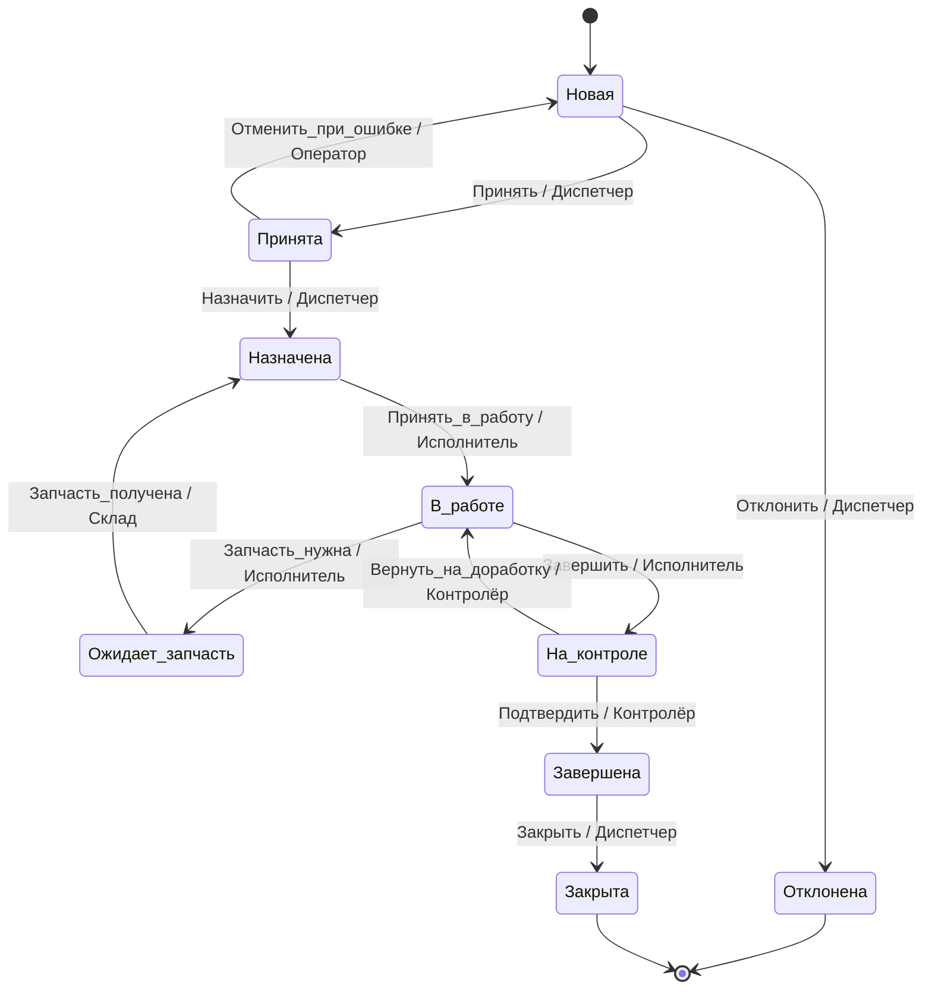
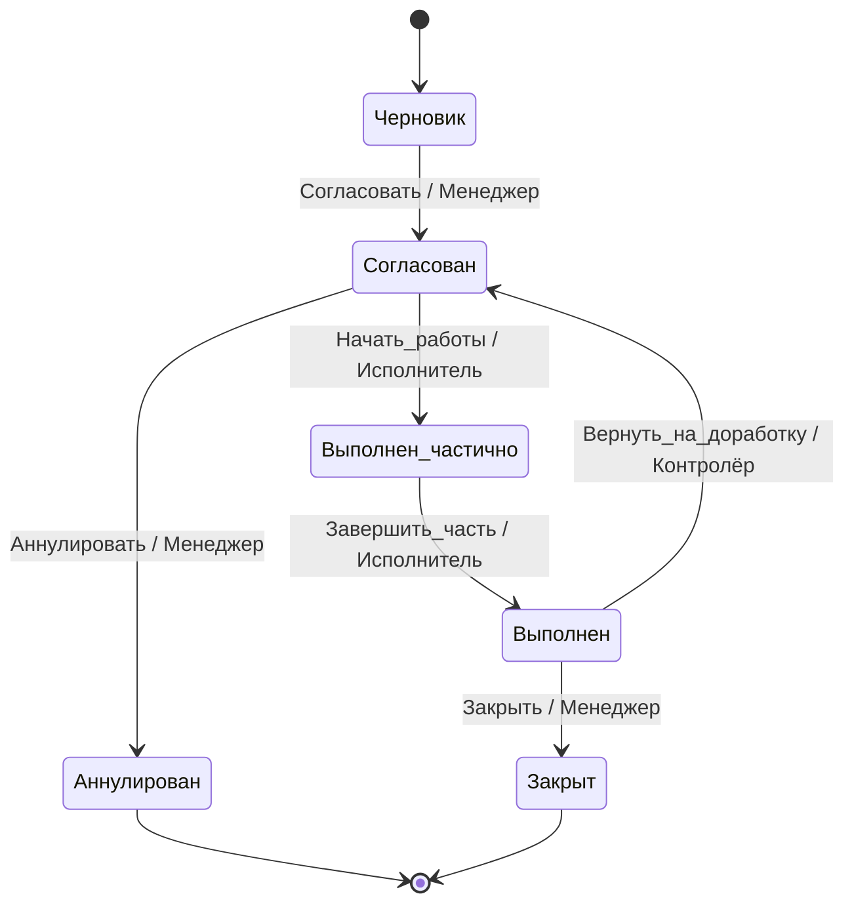
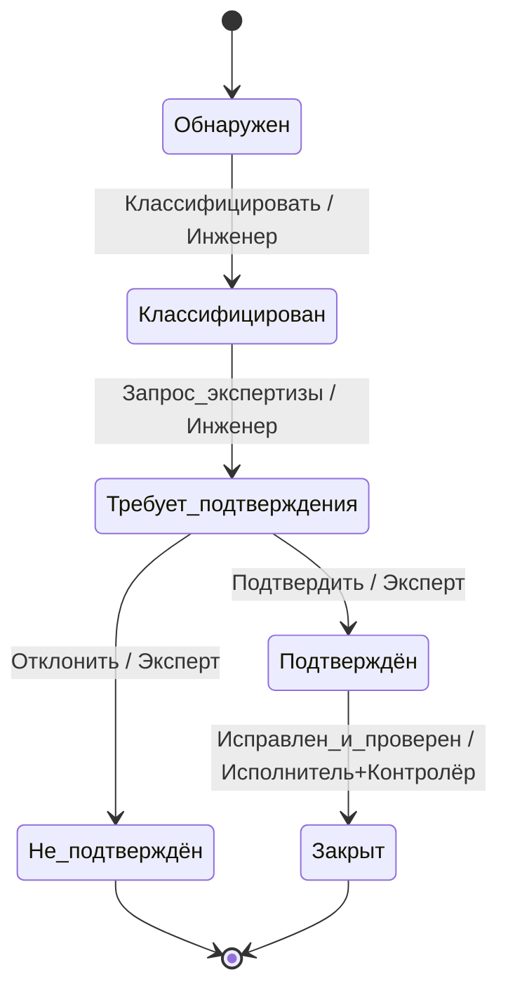

## 1. Выбор сущностей и обоснование

Выбранные сущности и риски при отсутствии формальной модели

| Сущность | Причина выбора | Риски без модели |
|---|---:|---|
| Заявка на ремонт | Первичный артефакт прихода проблемы от эксплуатации | Потеря статуса, дубли, некорректная приоритизация, неопределённость ответственности |
| Наряд на выполнение работ | Документ планирования/контроля работ техобслуживания | Несогласованность статусов с заявкой, пропуск работ, некорректный расчёт трудозатрат |
| Дефект | Техническая характеристика неисправности, фиксируемая при обследовании | Разночтения в классификации, ошибки в маршрутизации на ремонт/замену, отсутствие условий окончания |

---

## 2. Полный набор состояний и смысл по сущностям

### Заявка на ремонт

| Состояние | Краткое описание | Терминальное? | Возможен возврат |
|---|---|:---:|:---:|
| Новая | Заявка создана, первичный ввод | Нет | Нет (переходит в Принята/Отклонена) |
| Принята | Принял диспетчер/планировщик для обработки | Нет | Да (в Новая — только при ошибке ввода) |
| Назначена | Назначен ответственный/бригада | Нет | Да (в Принята) |
| В работе | Исполнитель приступил к работам | Нет | Нет (возможно частичный возврат в Назначена при отмене) |
| Ожидает запчасть | Работа ожидает деталей | Нет | Да (в Назначена/В работе) |
| На контроле | После завершения — ожидает проверки качества | Нет | Да (в В работе или Завершена) |
| Завершена | Работы выполнены, результат подтверждён | Нет | Да (в На контроле при возврате) |
| Закрыта | Проверка завершена, документ закрыт | Да | Нет |
| Отклонена/Отменена | Заявка не подлежит выполнению | Да | Нет |

---

### Наряд на выполнение работ

| Состояние | Описание | Терминальное? | Возврат |
|---|---|:---:|:---:|
| Черновик | Создаётся план работ | Нет | Да |
| Согласован | Согласован ответственными | Нет | Да (отменить согласование) |
| Выполнен частично | Часть работ завершена | Нет | Да |
| Выполнен | Все работы выполнены | Нет | Да (возврат на доработку) |
| Закрыт | Финальное закрытие наряда | Да | Нет |
| Аннулирован | Наряд отменён | Да | Нет |

---

### Дефект

| Состояние | Описание | Терминальное? | Возврат |
|---|---|:---:|:---:|
| Обнаружен | Зафиксирован дефект | Нет | Нет |
| Классифицирован | Оценен тип/приоритет/критичность | Нет | Да |
| Требует подтверждения | Нужна экспертиза/доп.диагностика | Нет | Да |
| Подтверждён | Дефект подтверждён для ремонта | Нет | Да |
| Не подтверждён | Ошибка регистрации, закрывается | Да | Нет |
| Закрыт | Исправлен и проверен | Да | Нет |

---

## 3. События и инициаторы

| Событие | Инициатор | Автоматическое? | Примечание |
|---|---|:---:|---|
| Создать | Оператор/Сотрудник эксплуатации | Нет | создаёт Новую/Черновик/Обнаружен |
| Назначить | Диспетчер/Планировщик | Нет | назначить исполнителя/бригады |
| Принять в работу | Исполнитель/Диспетчер | Нет | перевод в В работе |
| Приостановить/Ожидать запчасть | Исполнитель/Система | Нет/Да | может инициировать автомат при отсутствии запчастей |
| Завершить | Исполнитель | Нет | заполнение отчёта и перевод в На контроле/Завершена |
| Подтвердить | Контролёр/Инженер качества | Нет | перевод в Закрыт/Завершена |
| Отклонить/Отменить | Диспетчер/Менеджер | Нет | перевод в Отменена/Отклонена |
| Таймаут | Система (таймер SLA) | Да | автоматический переход (например эскалация) |
| Интеграция_результат | Внешняя система (склад, ERP) | Да | изменение статуса по наличию запчастей |
| Вернуть на доработку | Контролёр/Заказчик | Нет | возврат к В работе/Согласован |

---

## 4. Диаграммы состояний

### Заявка на ремонт (mermaid)

---

### Наряд на выполнение работ

---

### Дефект

---

## 5. Инварианты и обязательные данные по состояниям

### Заявка на ремонт

| Состояние | Обязательные поля | Запрещённые поля | Инварианты | Контроль |
|---|---|---|---|---|
| Новая | инициатор, объект_оборудования, описание | исполнитель, дата_завершения | id заявки уникален | Приложение/БД (уникальность) |
| Принята | приоритет, ответственный_группа | дата_завершения | приоритет в допустимом диапазоне | Домен/Сервис |
| Назначена | исполнитель | дата_завершения | исполнитель должен быть доступен | Приложение, проверка каталога пользователей |
| В_работе | дата_начала | статус_готовности="в работе" | исполнитель не null | Домен |
| Ожидает_запчасть | требуемые_детали | дата_завершения | список запчастей валиден | Интеграция со складом |
| Завершена | отчёт_о_работе, дата_завершения | — | отчёт соответствует шаблону | Приложение + валидация формата |
| Закрыта | акт_приёма, результат_контроля | — | акт подписан уполномоченным | Аудит/БД |

Инварианты, применимые ко всем сущностям:
- id — уникален.
- состояние и версия записи согласованы (version+optimistic lock).
- дата_создания <= дата_последнего_обновления.
Контроль: часть инвариантов на уровне доменной логики, часть — транзакционно в приложении и БД (ограничения, индексы).

---

## 6. Правила прав доступа и аудит переходов

Ключевые переходы

| Сущность | Переход (событие) | Роль, имеющая право | Обязательный аудит? | Поля в журнале |
|---|---|---:|:---:|---|
| Заявка | Назначить | Диспетчер, Руководитель смены | Да | id, старое_состояние, новое_состояние, исполнитель, время, инициатор |
| Заявка | Принять в работу | Исполнитель, Диспетчер | Да | отчёт_начало |
| Заявка | Завершить | Исполнитель | Да | отчёт_работы, фото/документы |
| Наряд | Согласовать | Менеджер, Руководитель участка | Да | номер_наряда, изменения, подпись |
| Дефект | Подтвердить | Эксперт/Инженер | Да | описание_экспертизы, время, инициатор |

Требование к сообщению об ошибке при недостатке прав: краткое объяснение + код ошибки

Коды ошибок (пример):
- ERR403_NOPERM_ASSIGN — нет права назначать.
- ERR400_INVALID_STATE — переход недопустим из текущего состояния.
- ERR409_CONFLICT — конфликт версии.
- ERR422_MISSING_FIELD — отсутствуют обязательные поля.

Аудит должен хранить immutable запись: кто, когда, действие, поля до/после, версия.

---

## 7. Таблица переходов как спецификация (выдержка)

Для заявки:

| Текущее состояние | Событие | Новое состояние | Условия (гард) | Обязательные данные | Код ошибки при отказе |
|---|---|---|---|---|---|
| Новая | Принять | Принята | роль инициатора ∈ {Диспетчер, Менеджер} | приоритет | ERR403_NOPERM_ASSIGN |
| Новая | Отклонить | Отклонена | роль ∈ {Диспетчер} | причина_отклонения | ERR403_NOPERM_ASSIGN |
| Принята | Назначить | Назначена | исполнитель доступен | исполнитель | ERR400_INVALID_STATE / ERR422_MISSING_FIELD |
| Назначена | Принять_в_работу | В_работе | исполнитель==инициатор | дата_начала | ERR403_NOPERM_ASSIGN / ERR409_CONFLICT |
| В_работе | Завершить | На_контроле | отчёт_завершения заполнен | отчёт_работы, фото | ERR422_MISSING_FIELD |
| На_контроле | Подтвердить | Завершена | контролёр имеет право | результат_контроля | ERR403_NOPERM_ASSIGN |
| Завершена | Закрыть | Закрыта | SLA истёк/проверка пройдена | акт_приёма | ERR400_INVALID_STATE |

Атомарность:
- Переходы, затрагивающие интеграцию со складом (перевод в Ожидает_запчасть/возврат после прихода) должны быть атомарны с операцией резерва/списания запчасти — чтобы избежать рассинхрона. Причина: консистентность инвентаря и статуса работ.
- Переход "Завершить" должен atomically сохранить отчёт + изменить статус + создать запись аудита.

---

## 8. Конфликты параллельных изменений

Сценарии:
- Диспетчер назначает исполнителя одновременно с исполнителем, принимающим в работу — возможен конфликт версии.
- Исполнитель обновляет отчёт одновременно с системной автоматикой закрытия по таймауту.

Предложенный механизм:
- Оптимистическая блокировка: каждой записи поле version (число). При обновлении клиента система проверяет version; если не совпадает — возврат ERR409_CONFLICT с описанием конфликта и новыми данными.
- Альтернативно: ограничения на уровне транзакции при критических операциях (pessimistic lock) для длинных операций.

Сообщение о конфликте пользователю:
- Текст: "Конфликт: запись изменилась (ERR409_CONFLICT). Обновлённые данные показаны. Повторите действие." + показать diff полей.
- Рекомендация: пользователь может пересмотреть изменения и повторить или отменить операцию.

---

## 9. Набор тест кейсов

| № | Название теста | Входные данные | Начальное состояние | Событие | Ожидаемое состояние | Ожидаемая ошибка |
|---:|---|---|---|---|---|---|
| 1 | Успешное создание заявки | корректные поля, инициатор — Оператор | (создание) | Создать | Новая | — |
| 2 | Принять заявку диспетчером | роль — Диспетчер | Новая | Принять | Принята | — |
| 3 | Отклонить заявкy без права | роль — Исполнитель (нет права) | Новая | Отклонить | — | ERR403_NOPERM_ASSIGN |
| 4 | Назначить исполнителя без указания исполнителя | отсутствует поле исполнитель | Принята | Назначить | — | ERR422_MISSING_FIELD |
| 5 | Назначить и принять в работу корректно | исполнитель доступен | Принята → Назначена | Назначить; Принять_в_работу | В_работе | — |
| 6 | Конфликт при параллельном назначении (версия) | две сессии, обе version=1 | Назначена | Изменить исполнитель (вторая сессия) | — | ERR409_CONFLICT |
| 7 | Переход в Ожидает_запчасть (авто) | сообщение склада: нехватка | В_работе | Запчасть_нужна (авто) | Ожидает_запчасть | — |
| 8 | Возврат из Ожидает_запчасть после прихода | сообщение склада: поступление | Ожидает_запчасть | Запчасть_получена | Назначена | — |
| 9 | Завершение без отчёта | отчёт пуст | В_работе | Завершить | — | ERR422_MISSING_FIELD |
| 10 | Завершение с отчётом и переход на контроль | отчёт заполнен | В_работе | Завершить | На_контроле | — |
| 11 | Контролёр подтверждает завершение | роль — Контролёр | На_контроле | Подтвердить | Завершена | — |
| 12 | Попытка закрыть заявку не из Завершена | роль — Диспетчер | В_работе | Закрыть | — | ERR400_INVALID_STATE |
| 13 | Аннулирование наряда в Черновике | роль — Менеджер | Черновик | Аннулировать | Аннулирован | — |
| 14 | Возврат наряда на доработку после проверки | контроль выявил недочёт | Выполнен | Вернуть_на_доработку | Согласован | — |
| 15 | Подтверждение дефекта экспертом | роль — Эксперт | Требует_подтверждения | Подтвердить | Подтверждён | — |