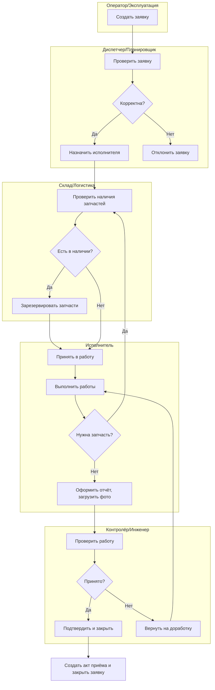
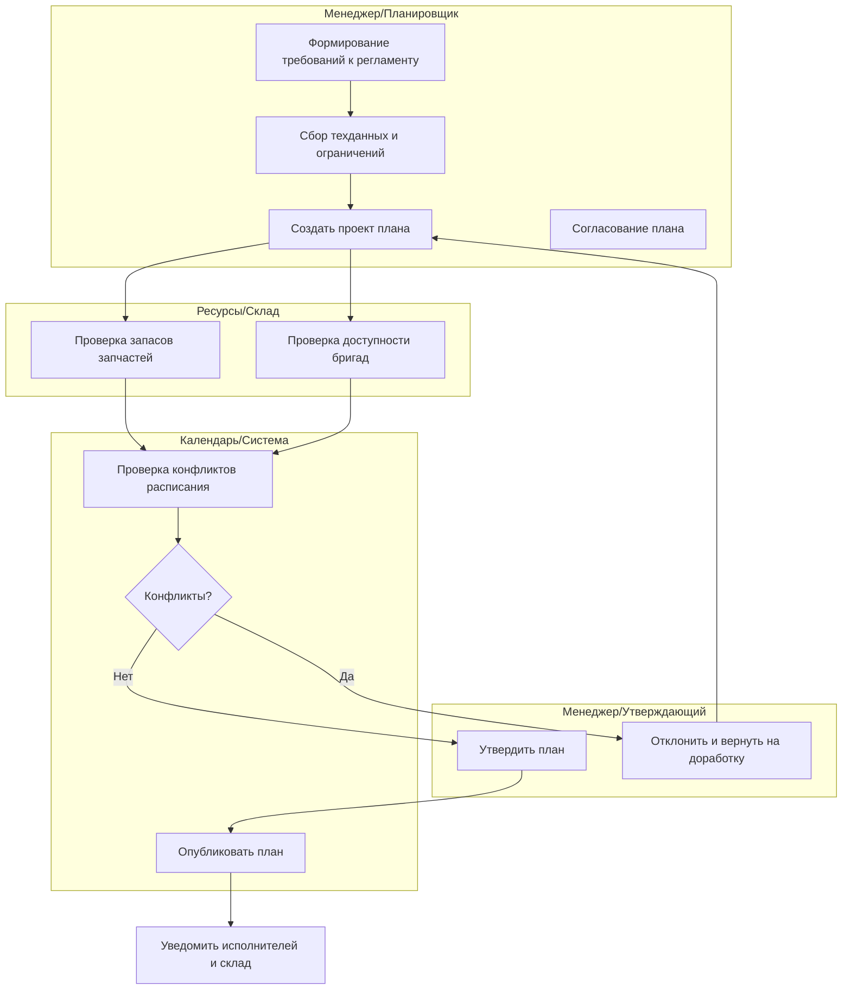

## 1. Выбор процессов, границы и результативность

| № | Процесс | Границы (начало — конец) | Критерий успешного завершения | Важные бизнес‑результаты |
|---:|---|---|---|---|
| 1 | Обработка заявки на ремонт | создание заявки пользователем — закрытие заявки после контроля | заявка закрыта; дефект устранён; акт приёма загружен | снижение простоя, оперативность реагирования, прозрачность ответственности |
| 2 | Планирование регламентных работ | формирование годового/месячного плана — утверждённый и опубликованный план | план утверждён и задания запланированы в календаре | регулярность ТО, равномерная загрузка бригад, снижение аварийности |

---

## 2. Роли и дорожки ответственности

| Роль | Описание обязанностей |
|---|---|
| Оператор/Эксплуатация | Создание заявки, первоначальное описание проблемы |
| Диспетчер / Планировщик | Приём заявок, назначение исполнителей, эскалация |
| Исполнитель (бригада/техник) | Выполнение работ, отчётность |
| Склад / Логистика | Подтверждение наличия/резерва запчастей |
| Контролёр качества / Инженер | Проверка выполненных работ, подтверждение закрытия |
| Менеджер / Руководитель участка | Согласование нарядов, аннулирование, утверждение плана |
| Система (автомат) | Таймауты SLA, интеграции (склад/ERP), уведомления |

---

## 3. Диаграмма деятельности: Процесс 1

### Обработка заявки на ремонт

Ключевые точки автоматизации: проверка SLA (система), уведомления инициатору и диспетчеру, резерв/списание запчастей (интеграция со складом). Ожидание внешних событий: поступление запчасти, автоматический таймаут эскалации.

---

## 4. Диаграмма деятельности: Процесс 2

### Планирование регламентных работ

Отдельные ветви по нехватке запчастей: если R1 показывает дефицит, формируется задача на закупку и план откладывается/переносится. При конфликте расписаний — обратная связь менеджеру для пересчёта ресурса/даты.

---

## 5. Параллельные ветви и синхронизация

- В процессе 1 параллельно: назначение исполнителя и проверка наличия запчастей (параллельные задачи); синхронизация перед началом работ — оба результата должны быть готовы (join).
- В процессе 2 параллельно собираются данные по складу и по доступности бригад; синхронизация через шаг проверки конфликтов.
- Риски гонок: двойное резервирование запчастей, одновременное изменение расписания. Меры:
  - Оптимистическая блокировка + проверка версии записи.
  - Транзакционная операция при резервировании (атомарность резерва + фиксации статуса).
  - Централизованные очереди задач для назначений (FIFO) при высоком параллелизме.

---

## 6. Данные на шагах процесса

| Процесс | Шаг | Исполнитель | Входные данные | Выходные данные | Обязательные поля |
|---|---|---|---|---|---|
| Обработка заявки | Создать заявку | Оператор | объект_оборудования, описание, приоритет | заявка (id) | объект_оборудования, описание |
| Обработка заявки | Проверить заявку | Диспетчер | заявка | решение корректности | приоритет |
| Обработка заявки | Назначить | Диспетчер | заявка, список_исполнителей | исполнитель | исполнитель |
| Обработка заявки | Проверить склад | Склад система | список_запчастей | наличие/резерв | список_запчастей |
| Обработка заявки | Выполнить работы | Исполнитель | заявка, резервы | отчёт_о_работе, фото | отчёт_работы |
| Обработка заявки | Проверка качества | Контролёр | отчёт_о_работе | результат_проверки, акт | результат_проверки |
| Планирование | Создать проект плана | Планировщик | регламенты, ограничения | проект_плана | сроки, список работ |
| Планирование | Проверка ресурсов | Склад/Ресурсы | проект_плана | доступность | список_запчастей |
| Планирование | Проверка расписаний | Система | проект_плана, доступность | конфликт/ок | календарь |

Где создаётся сущность: заявка, проект_плана, наряд.  
Где фиксируется событие: запись в журнал аудита при каждом переходе.

---

## 7. Связь с прецедентами, правами и аудитом

- Каждый шаг сопоставлен с прецедентом: создание заявки — прецедент "Создать заявку"; назначение — "Назначить исполнителя"; выполнение — "Выполнить работы" и т.д.
- Шаги, требующие прав и обязательного аудита: назначение (Диспетчер), аннулирование/отмена (Менеджер), подтверждение (Контролёр), резервы списания со склада (Склад).
- Аудит: для каждого критического шага сохраняются: id сущности, старое/новое состояние, инициатор, время, версия, изменения в полях.

---

## 8. Метрики процесса и точки контроля

| Метрика | Где фиксируется | Порог тревоги |
|---|---|---|
| Время от создания до принятия | при событии "Принять" | > 2 ч |
| Время от назначения до начала работ | при событии "Принять в работу" | > 4 ч |
| Доля возвратов на доработку | при событии "Вернуть" | > 5% |
| Доля просрочек закрытия | при событии "Закрыть" | > 3% |
| Среднее время цикла план‑публикация | при публикации плана | > 14 дней |

Метрики фиксируются в журнале событий и агрегируются ETL/BI. Пороговые значения — примерные, настраиваются под предприятие.

---

## 9. Регламент процесса – Процесс 1

1. Оператор создаёт заявку: заполняет объект оборудования, описание и приоритет. Доказательство: запись заявки в системе с id.
2. Диспетчер проверяет заявку в течение SLA (2 ч). При некорректности — отклоняет, указывает причину.
3. Если корректна — диспетчер назначает исполнителя. Одновременно система проверяет склад и резервирует запчасти при необходимости.
4. Исполнитель принимает в работу и выполняет работы; при необходимости ставит заявку в состояние "ожидает запчасть".
5. По завершении исполнитель загружает отчёт и фото — обязательные доказательства.
6. Контролёр проверяет отчёт в течение SLA (24 ч). При подтверждении формируется акт приёма и заявка закрывается; при несоответствии — возврат на доработку.
7. При системных сбоях: операции с резервами откатываются; пользователю предлагается повторить действие после восстановления.

Сроки, роли, доказательства и каналы уведомлений зафиксированы выше.

---

## 10. Тест‑кейсы по процессам

| № | Процесс | Название кейса | Условия | Шаги | Ожидаемый статус сущности | Ожидаемые уведомления |
|---:|---|---|---|---|---|---|
| 1 | Обработка заявки | Создание и быстрое назначение | корректные данные, диспетчер онлайн | Создать → Принять → Назначить | Назначена | уведомление исполнителю |
| 2 | Обработка заявки | Начало работ при наличии запчастей | запчасти в наличии | Назначить → Резерв → Принять в работу | В_работе | уведомление склад/исполнитель |
| 3 | Обработка заявки | Переход в ожидание запчасти | отсутствуют запчасти | Принять в работу → Обнаружено отсутствие → Ожидает_запчасть | Ожидает_запчасть | уведомление диспетчеру |
| 4 | Обработка заявки | Возврат на доработку после контроля | отчёт не соответствует | Выполнить → Загрузить отчёт → Контроль → Вернуть | В_работе | уведомление исполнителю и диспетчеру |
| 5 | Обработка заявки | Успешное закрытие заявки | отчёт корректен | Выполнить → Контроль → Подтвердить → Закрыть | Закрыта | уведомление инициатору |
| 6 | Обработка заявки | Конфликт при параллельном назначении | два диспетчера назначают | Диспетчер A назначил; Диспетчер B пытается назначить | ERR409_CONFLICT на второй | уведомление о конфликте |
| 7 | Планирование | Утверждение плана без конфликтов | ресурсы в наличии | Сбор → Проект → Проверка расписаний → Утвердить → Опубликовать | План опубликован | уведомления бригадам |
| 8 | Планирование | Обнаружен конфликт расписаний | bригад недостаточно | Проверка расписаний → Конфликт → Возврат на доработку | Проект плана (черновик) | уведомление менеджеру |
| 9 | Планирование | Дефицит запчастей в плане | склад сообщает дефицит | Проект → Проверка склада → Создать задачу на закупку | Проект отложен | уведомление закупкам |
| 10 | Обработка заявки | Таймаут SLA по принятию | диспетчер не принял в SLA | Создать → таймаут SLA | Эскалация к менеджеру | уведомление менеджеру |
| 11 | Обработка заявки | Попытка закрыть до проверки | исполнитель пытается закрыть напрямую | Попытка Закрыть из В_работе | ERR400_INVALID_STATE | уведомление о причине отказа |
| 12 | Планирование | Повторная публикация плана после доработки | план отклонён и исправлен | Возврат → Исправить → Утвердить → Опубликовать | План опубликован | уведомление всем участникам |

Минимальный регрессионный набор: кейсы 1,2,5,6,7,10.