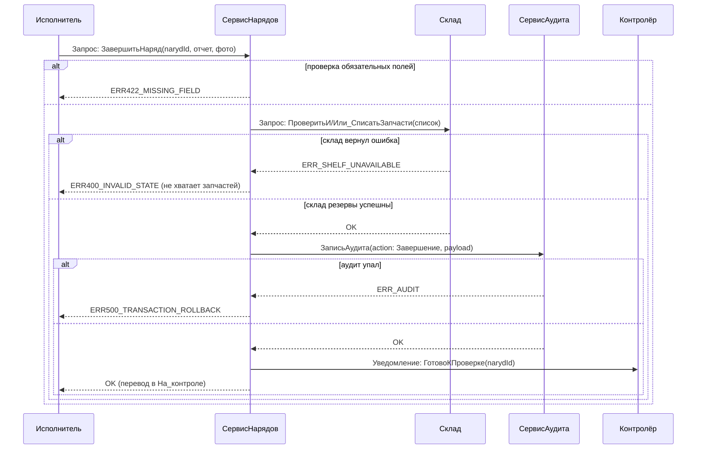
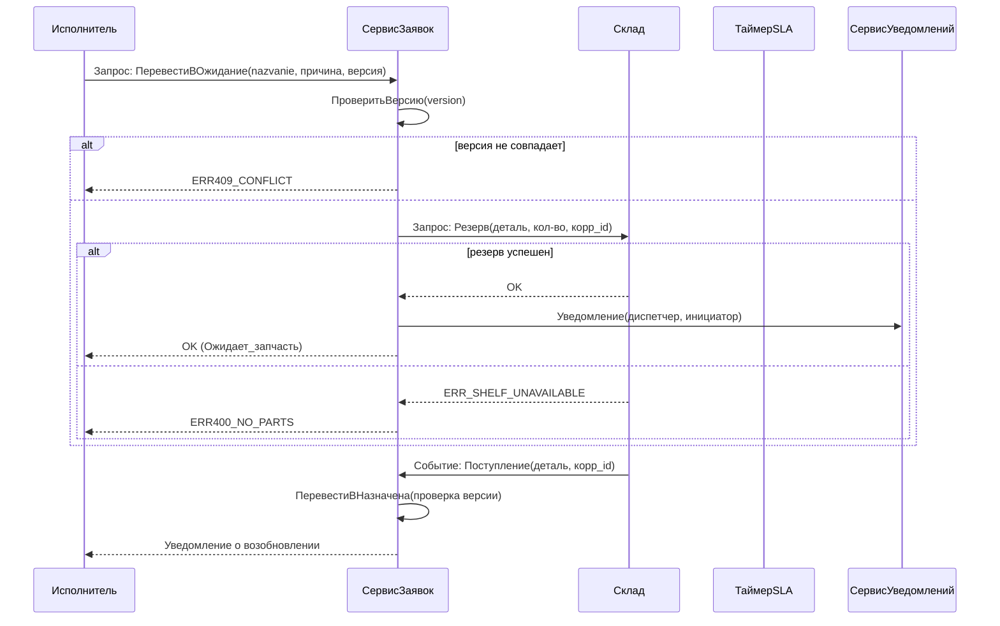
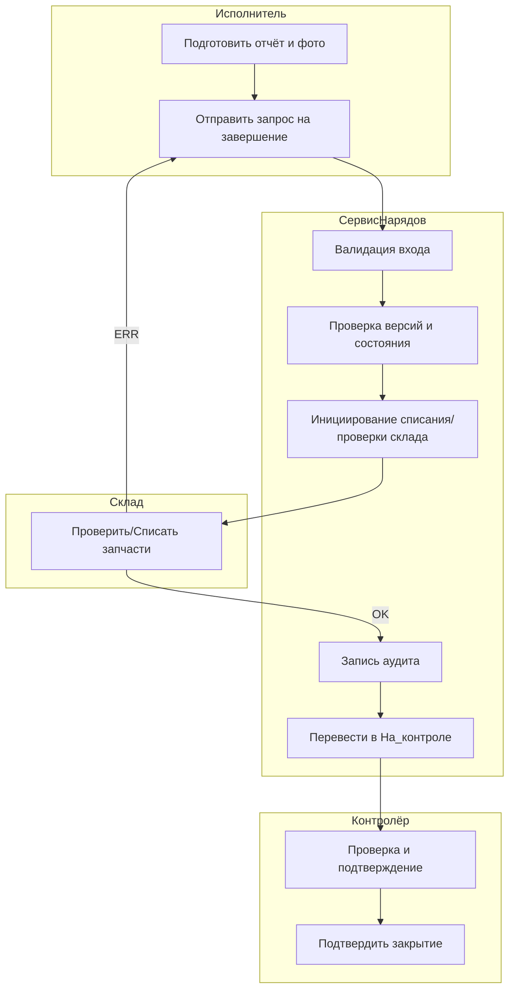
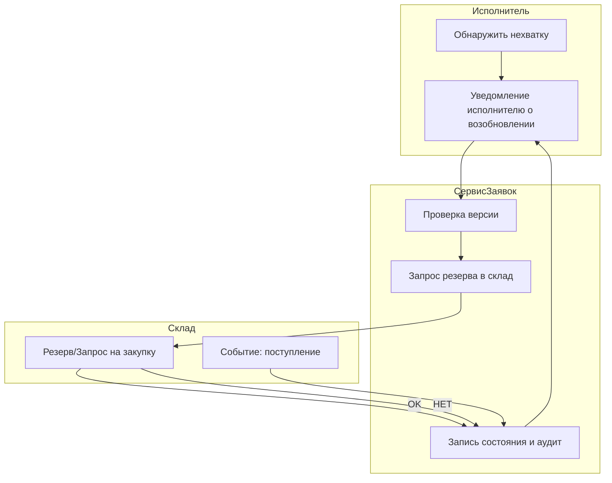
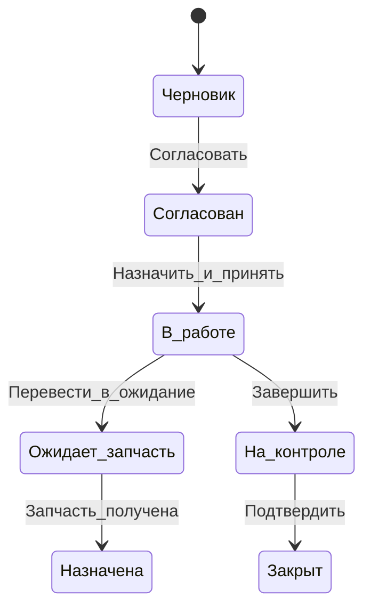

## 1. Перечень поведенческих требований

| id | Требование | Критерий проверки | Источник |
|---:|---|---|---|
| BR-01 | Корректное закрытие наряда — только после подтверждения контроля | Автотест: попытка перейти в "Закрыт" без подтверждения — ошибка ERR400_INVALID_STATE; успешный путь — акт в журнале | прецеденты, регламент |
| BR-02 | Обновление статуса заявки должно быть атомарно с сохранением отчёта и созданием аудита | P0 интеграционный тест: при сбое записи аудита транзакция откатывается | интервью с эксплуатацией |
| BR-03 | Эскалация при пропуске SLA по принятию заявки | Система генерирует событие "Эскалация" по таймеру; уведомление менеджеру | SLA‑требования |
| BR-04 | Резервирование запчастей — идемпотентная операция | Повторное получение ответа "резервировано" не создаёт дубликатов резерва | интеграция со складом |
| BR-05 | Конфликты параллельных назначений приводят к ERR409_CONFLICT с инструкцией | Симуляция двух параллельных назначений даёт ошибку и новый state | исторические инциденты |

---

## 2. Выбор сценариев

Выбраны два сценария:

A) Сценарий «Закрытие наряда»  
- Границы: исполнитель завершил работы — наряд закрыт и акт приёма создан.  
- Ожидаемый эффект: наряд → Закрыт; акт сохранён; аудит записан; уведомления отправлены.  
- Интеграции: склад (приписка запчастей), система учёта рабочего времени, BI (агрегация метрик).  
- Учитываемые сбои: недоступность БД, ошибка записи аудита, сбой склада при подтверждении списания.

B) Сценарий «Обновление статуса заявки (в работу → ожидание запчасти → возобновление)»  
- Границы: исполнитель переводит заявку в Ожидает_запчасть по причине нехватки — после прихода запчасти возобновляет работу.  
- Эффект: согласованное состояние + запись резерва/списания запчасти.  
- Интеграции: склад (резерв), уведомления (почта/SMS), таймеры SLA.  
- Сбои: несогласованность резерва (двойной резерв), задержка уведомления, конфликт версии записи.

---

## 3. Набор диаграмм для каждого сценария

Для каждого сценария построены три диаграммы:
- диаграмма взаимодействия (sequence) — показывает обмен сообщениями между компонентами/ролями;
- диаграмма деятельности (activity) — поток действий с дорожками ответственности;
- диаграмма состояний (state) — состояния сущности и допустимые переходы.

Правило источника истины:
- Источник истины для статусов сущности — доменная модель в базе данных с транзакционными ограничениями (поле state), подтверждённая бизнес-логикой сервиса (domain service). Диаграммы являются спецификацией; реализация обязана согласовать изменения состояния с доменной логикой.

---

## 4. Диаграммы взаимодействия

### A) Закрытие наряда — диаграмма взаимодействия

Контракты сообщений:
- ЗавершитьНаряд: {narydId, отчет, фото[], версия}
- ПроверитьИ/Или_СписатьЗапчасти: {список_компонентов, количество, корр_id}
- ЗаписьАудита: {сущность, старое_состояние, новое_состояние, инициатор, время, корр_id}

Точки логирования: перед вызовом Склад, после ответа, перед записью аудита, при ошибке — все с correlation_id.

Типовые ошибки: ERR422_MISSING_FIELD, ERR_SHELF_UNAVAILABLE, ERR_AUDIT, ERR409_CONFLICT, ERR500_TRANSACTION_ROLLBACK.

### B) Обновление статуса заявки — диаграмма взаимодействия

Контракты: Резерв: {деталь_id, кол-во, corr_id}; Ответы: {status, reservation_id}.

---

## 5. Диаграммы деятельности

### A) Закрытие наряда

### B) Обновление статуса заявки (ожидание запчасти и возобновление)

---

## 6. Сопоставление с диаграммами состояний

### Диаграмма состояний для наряда

Проверки:
- Все переходы, показанные в диаграммах деятельности и взаимодействия, присутствуют в диаграмме состояний.  
- Недопустимые переходы (например Закрыт → В_работе) запрещены — при попытке дают ERR400_INVALID_STATE.  
- Атомарность изменения состояния: реализовать через транзакцию БД, объединяющую изменение state + запись аудита + списание с склада (при необходимости) — это отмечено в таблице трассируемости.

---

## 7. Обработка ошибок, идемпотентность, компенсации

| Ошибка | Поведение системы | Должна быть идемпотентной? | Компенсационная операция |
|---|---|:---:|---|
| Недоступность БД (write) | Откат операции, возврат ERR500, повтор по требованию | нет (операция атомарна) | Повтор внешним вызовом; если частично выполнено — ручная проверка |
| ERR409_CONFLICT (версия) | Отклонить с текущим состоянием; вернуть актуальную версию | да (повтор с новой версией) | Повтор с обновлённой версией |
| ERR_SHELF_UNAVAILABLE | Перевести заявку в Ожидание/создать запрос закупки | операция резервирования должна быть идемпотентной | Отмена резерва при отмене наряда |
| ERR_AUDIT (запись в аудит упала) | Откат транзакции по умолчанию; лог в локальной очереди | аудит должен быть идемпотентен | Повторная отправка записи аудита после восстановления |
| Ошибка уведомления | Операция считается успешной; уведомление в очереди retry | да | retry — повторная отправка уведомления |

Идемпотентность достигается:
- использование correlation_id и уникальных ключей (reservation_id, audit_id);
- обработка повторных запросов по id: если операция уже выполнена, вернуть OK и не дублировать ресурс.

Компенсационные сценарии:
- если списание запчасти прошло, а запись наряда не завершилась (из-за ошибки аудита), создать задачу компенсации: восстановление резерва/возврат детали или ручная сверка.

---

## 8. Таблица трассируемости требований, диаграммы, тесты

| id | Диаграммы | Тест кейсы | Способ проверки |
|---|---|---|---|
| BR-01 | взаимодействие A, деятельность A, состояния наряда | TC-05 (успешное закрытие), TC-11 (попытка закрыть преждевременно) | автоматические тесты, журнал аудита, проверка акта |
| BR-02 | взаимодействие A, деятельность A | TC-05, TC-06 (конфликт) | интегр.тест: при ошибке аудита всё откатывается |
| BR-03 | взаимодействие B (таймер), деятельность B | TC-10 (таймаут SLA) | симуляция таймера, проверка события "Эскалация" в логе |
| BR-04 | взаимодействие B (склад), состояния заявки | TC-07, TC-08 (резерв/поступление) | интеграционные тесты со складом (мок/стенд) |
| BR-05 | взаимодействие A/B, состояния | TC-06 (конфликт назначений) | симуляция параллельных запросов, проверка ERR409_CONFLICT |

Изменения, требующие обновления таблицы: изменение SLA, контрактов со складом, добавление новой роли — т.к. затрагивают диаграммы взаимодействия и тесты.

---

## 9. Наблюдаемость и диагностика (логи, метрики, трассировка)

Минимальный набор событий в логах (immutable записей) для каждого критического сценария:
- REQUEST_RECEIVED (с correlation_id, initiator, payload_hash)
- STATE_CHANGE (entity_id, старое_state, новое_state, initiator, версия)
- EXTERNAL_CALL_START / EXTERNAL_CALL_END (component, request, response, duration, status)
- AUDIT_RECORD_CREATED (audit_id, entity_id, action)
- ERROR_OCCURRED (code, message, stack?, correlation_id)
- SCHEDULE_EVENT (SLA таймер срабатывания, correlation_id)

Метрики:
- mttr_naryd — среднее время закрытия наряда (в мин.)
- sla_breach_count — количество нарушенных SLA по приёму/контролю
- retry_rate_external — частота ретраев к внешним системам
- conflict_rate — доля операций с ERR409_CONFLICT
- audit_fail_rate — доля неуспешных записей аудита

Диагностика по логам:
- correlation_id позволяет связать цепочку: запрос → вызовы внешних сервисов → изменение состояния → аудит → уведомления.  
- при большой доле ERR409_CONFLICT — смотреть версионность и частоту параллельных изменений, использовать трассировку запросов по user_id и timestamps.  
- при росте retry_rate_external — смотреть latency внешней системы и очередь retry; для склада — проверить очередь резервов и idempotency keys.

---

## 10. Набор тест кейсов

| TC | Сценарий | Шаги | Ожидаемое | Связанные требования |
|---:|---|---|---|---|
| TC-01 | Успешное закрытие наряда | выполнить отчет → запрос завершения → склад OK → аудит OK → контроль подтверждает | наряд → На_контроле → Закрыт; аудит записан | BR-01, BR-02 |
| TC-02 | Попытка закрыть без отчёта | отправить Завершить с пустым отчетом | ERR422_MISSING_FIELD | BR-02 |
| TC-03 | Сбой при записи аудита | аудит возвращает ERR_AUDIT | транзакция откатывается; наряд остаётся в В_работе; ERR500_TRANSACTION_ROLLBACK | BR-02 |
| TC-04 | Резерв отсутствует на складе | при резервировании склад ERR_SHELF_UNAVAILABLE | заявка → Ожидает_запчасть или ошибка; уведомление диспетчеру | BR-04 |
| TC-05 | Идемпотентный резерв | повторный вызов Резерв с тем же corr_id | второй вызов возвращает OK без дубликатов | BR-04 |
| TC-06 | Конфликт при параллельном назначении | два параллельных назначающих запроса | один OK, второй ERR409_CONFLICT | BR-05 |
| TC-07 | Поступление запчасти и возобновление | склад событие Поступление → сервис переводит в Назначена | уведомление исполнителю; состояние Назначена | BR-04 |
| TC-08 | Таймаут SLA по принятию | не принимать заявку в SLA | событие Эскалация генерируется | BR-03 |
| TC-09 | Недоступность БД при списании | попытка списания запчасти при write-fail | откат операции; задача компенсации | BR-02 |
| TC-10 | Ошибка уведомления | уведомление возвращает ERR | операция успешна; уведомление в очереди retry | BR-02 |
| TC-11 | Повторная попытка завершения после конфликта версий | получить ERR409, обновить версию, повторить | успешное завершение | BR-05 |