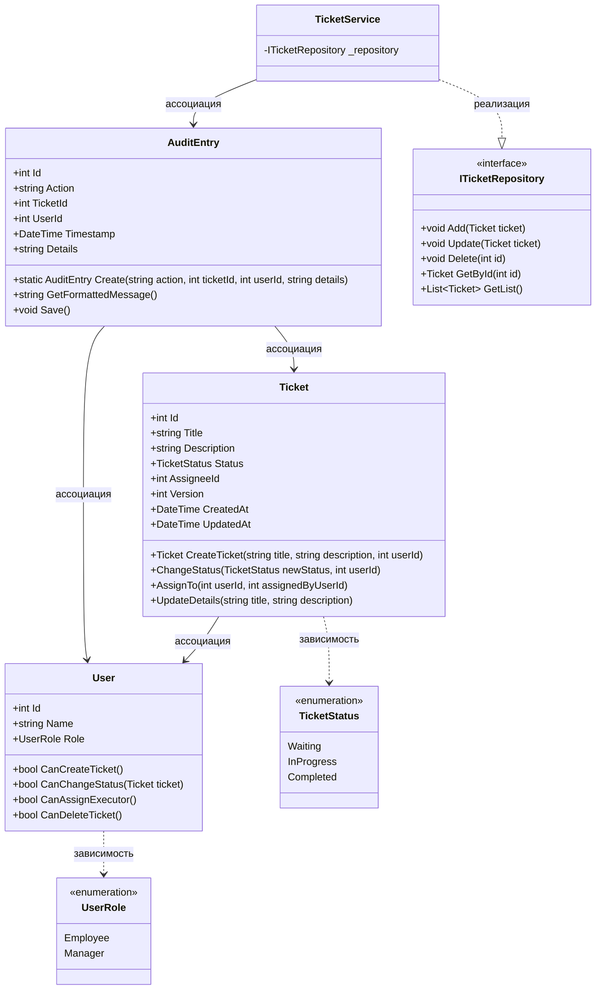
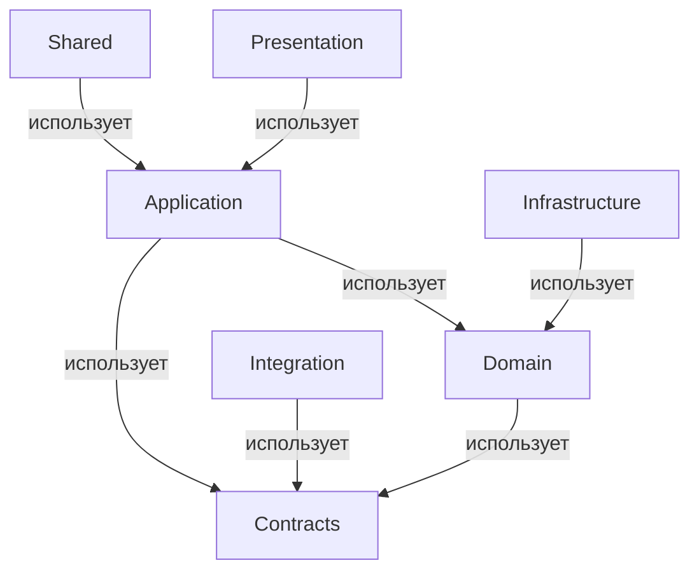

## Диаграмма классов



## Описание классов и связей

### 1. `Ticket` (Заявка)
Центральная сущность, отражающая заявку пользователя.

**Поля:**
- `Id : int` – уникальный идентификатор.
- `Title : string` – заголовок заявки (не может быть пустым).
- `Description : string` – описание проблемы/запроса.
- `Status : TicketStatus` – текущий статус заявки (Waiting, InProgress, Completed).
- `AssigneeId : int?` – идентификатор пользователя-исполнителя (nullable, если не назначен).
- `Version : int` – поле для оптимистичной блокировки (конкурентный контроль).
- `CreatedAt : DateTime` – дата создания.
- `UpdatedAt : DateTime` – дата последнего обновления.

**Методы:**
- `ChangeStatus(newStatus: TicketStatus, userId: int)` – изменяет статус заявки. Внутри проверяет права пользователя (через сервис или передавая роль) и применяет бизнес-правила (например, нельзя закрыть заявку без исполнителя).
- `AssignTo(userId: int, assignedByUserId: int)` – назначает исполнителя. Проверяет, что назначающий имеет права (менеджер или создатель заявки).
- `UpdateDetails(title: string, description: string)` – обновляет основные поля заявки (только для сотрудника, создавшего заявку, или менеджера).

### 2. `User` (Пользователь)
Представляет сотрудника или менеджера системы.

**Поля:**
- `Id : int` – уникальный идентификатор.
- `Name : string` – полное имя пользователя.
- `Role : UserRole` – роль (Employee или Manager).
- `PasswordHash : string` – хеш пароля для аутентификации.

**Методы:**
- `CanCreateTicket()` – возвращает `true`, если роль Employee или Manager.
- `CanChangeStatus()` – менеджеры всегда могут, сотрудники – только для своих заявок (логика проверки связки с заявкой вынесена в сервис).
- `CanAssignExecutor()` – только менеджеры.
- `CanDeleteTicket()` – только менеджеры.

### 3. `TicketStatus` (перечисление)
Статусы заявки согласно спецификации: `Waiting`, `InProgress`, `Completed`.

### 4. `UserRole` (перечисление)
Две роли: `Employee` (сотрудник) и `Manager` (менеджер).

### 5. `ITicketRepository` (интерфейс репозитория)
Абстракция доступа к данным. Позволяет отделить бизнес-логику от конкретной реализации БД.

**Методы:**
- `Add(Ticket ticket)` – добавить новую заявку.
- `Update(Ticket ticket)` – обновить существующую (с проверкой версии).
- `Delete(int id)` – удалить заявку.
- `GetById(int id)` – получить заявку по ID.
- `GetList(ISpecification spec)` – получить список заявок по заданному фильтру (например, по статусу, исполнителю, дате).
- `SaveChanges()` – сохранить изменения в БД (поддержка Unit of Work).

### 6. `TicketService` (сервис заявок)
Содержит бизнес-логику и координирует операции.

**Поля:**
- `_repository : ITicketRepository` – зависимость от репозитория.

**Методы:**
- `CreateTicket(title, description, createdByUserId)` – создаёт новую заявку со статусом `Waiting`. Проверяет права пользователя (через вызов `CanCreateTicket`). Возвращает созданный объект `Ticket`.
- `ChangeTicketStatus(ticketId, newStatus, userId)` – загружает заявку, проверяет права пользователя на изменение статуса (менеджер или владелец), применяет `ticket.ChangeStatus()`, сохраняет через репозиторий. При конфликте версий выбрасывает исключение.
- `AssignExecutor(ticketId, executorId, userId)` – назначает исполнителя. Проверяет, что `userId` имеет права менеджера. Обновляет заявку и логирует действие.
- `GetTickets(filter)` – возвращает отфильтрованный список заявок (доступен и сотрудникам, и менеджерам).
- `GetTicketById(id)` – получение детальной информации о заявке.
- `DeleteTicket(id, userId)` – удаляет заявку, если пользователь – менеджер. Перед удалением может проверить, что заявка не в процессе выполнения (по требованию бизнеса).

### 7. `AuditEntry` (аудит)
Фиксирует важные действия с заявками для наблюдаемости и безопасности.

**Поля:**
- `Id : int` – уникальный идентификатор записи аудита.
- `Action : string` – тип действия (например, "StatusChanged", "AssigneeAssigned", "TicketDeleted").
- `TicketId : int` – идентификатор заявки, над которой выполнено действие.
- `UserId : int` – идентификатор пользователя, выполнившего действие.
- `Timestamp : DateTime` – время события.
- `Details : string` – дополнительные данные в формате JSON (старый статус, новый статус, кто назначен и т.д.).

## Связи между классами

- **Ticket → TicketStatus**: зависимость (использование перечисления). Статус заявки не является самостоятельной сущностью.
- **Ticket → User (исполнитель)**: ассоциация *многие-к-одному*. У одного пользователя может быть много назначенных заявок, но в диаграмме показана ссылка через `AssigneeId`. Навигационное свойство `Assignee` (если реализовать ORM) позволит получить объект пользователя.
- **TicketService → ITicketRepository**: зависимость через интерфейс (Dependency Injection). Сервис использует репозиторий для доступа к данным.
- **TicketService → User**: сервис вызывает методы проверки прав (например, `user.CanChangeStatus()`) – это временная зависимость при выполнении операций.
- **AuditEntry → Ticket** и **AuditEntry → User**: ассоциации *многие-к-одному*. Каждая запись аудита ссылается на конкретную заявку и пользователя, которые участвовали в событии.
- **User → UserRole**: использование перечисления роли.
    
## 1. Перечень библиотек и их назначения

| Библиотека       | Ответственность                                                             | Запрещено размещать внутри                     |
|------------------|---------------------------------------------------------------------------|-----------------------------------------------|
| Domain           | Хранение бизнес-логики, сущностей, правил                                   | Все, что связано с инфраструктурой           |
| Application       | Реализация прикладной логики, управляемая пользователем                    | Прямое взаимодействие с базой данных         |
| Contracts         | Определение DTO, публичных интерфейсов                                      | Реализация бизнес-логики                      |
| Infrastructure    | Работа с технологиями доступа к данным и внешними системами                | Бизнес-логика, обрабатывающая данные         |
| Integration       | Взаимодействие с внешними системами и API                                   | Бизнес-логика, хранящая данные                |
| Presentation      | Взаимодействие с пользовательским интерфейсом и представление данных       | Логика обработки данных, доступ к БД         |
| Shared            | Общие утилиты, расширения, которые могут использоваться в других библиотеках | Специфическая логика других библиотек         |

---

## 2. Правила зависимостей между библиотеками

1. **Направления зависимостей**:
   - Presentation → Application
   - Application → Domain
   - Application → Contracts
   - Infrastructure → Domain (не допускается)
   - Domain → Shared

2. **Правила**:
   - Домен не зависит от инфраструктуры.

3. **Интерфейсы и реализации**:
   - Интерфейсы находятся в Contracts.
   - Реализации находятся в Infrastructure.
   - Это важно для соблюдения принципа инверсии зависимостей.

---

## 3. UML диаграмма пакетов структуры библиотек



---

## 6. Описание публичных контрактов библиотек

| Библиотека       | Публичный API                      | Ломающие изменения             | Документация                      |
|------------------|------------------------------------|--------------------------------|-------------------------------------|
| Domain           | Сущности, ЗначениеОбъект, Агрегаты | Изменение публичных методов    | Описание каждого элемента API      |
| Application      | Сервисы, Команды, Запросы          | Изменение сигнатур методов     | Примеры использования всех сервисов |
| Contracts        | DTO, Ошибки                        | Изменение структуры DTO       | Документация для всех DTO          |

---

## 7. Тестируемость и изоляция зависимостей

1. **Модульные тесты для Domain**:
   - Проверка инвариантов при добавлении и удалении сущностей.

2. **Изоляция инфраструктуры**:
   - Использование интерфейсов для доступа к данным.
   - Реализация через Dependency Injection.

3. **Интеграционные тесты**:
   - Проверка взаимодействия Application и Infrastructure.
   - Тестирование сценариев запуска и завершения транзакций.

---

## 8. Шаблон структуры репозитория и правила именования

### Дерево каталогов

```
/src
    /Domain
    /Application
    /Contracts
    /Infrastructure
    /Integration
    /Presentation
    /Shared
/docs
/tests
/migrations
```

### Правила именования
- Проекты: Название библиотеки + .Library
- Пространства имен: Название библиотеки + .Namespace
- Классы: Название роли + Имя сущности

### Хранение UML диаграмм
- Хранить в каталоге /docs, связывать с кодом через комментарии на уровне класса.

---

## 9. План сопровождения структуры библиотек

1. **Добавление новых модулей**:
   - Использовать правила зависимостей для предотвращения циклов.

2. **Процесс ревью архитектуры**:
   - Обсуждение изменений на архитектурных встречах, оценка влияния на существующий код.

3. **Критерии выделения библиотеки**:
   - Необходимость хранения логики в отдельной библиотеке при увеличении объема кода или ответственности.
