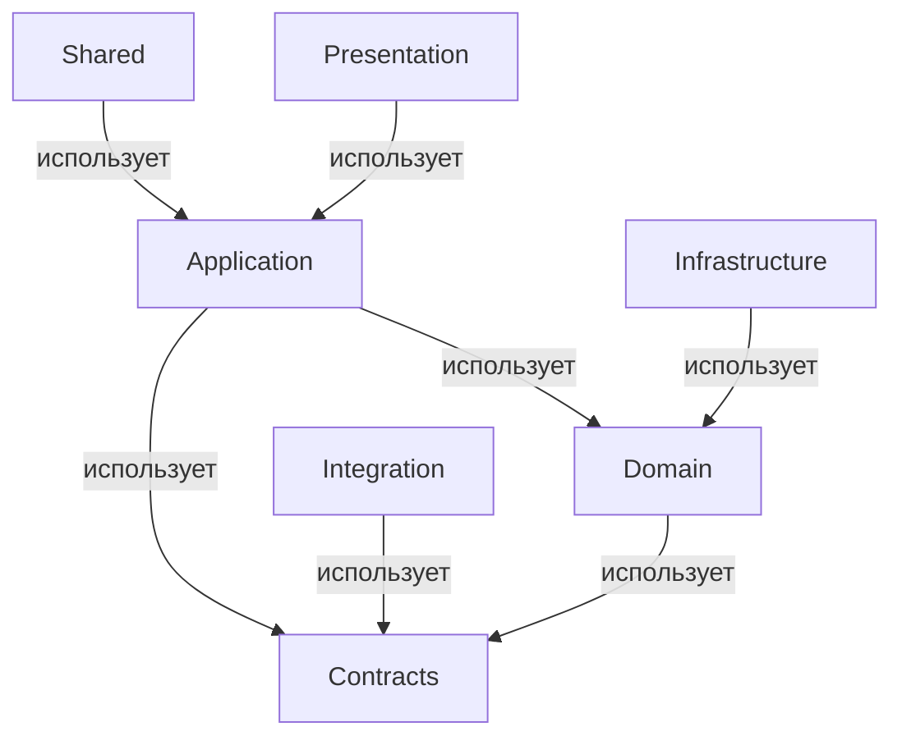
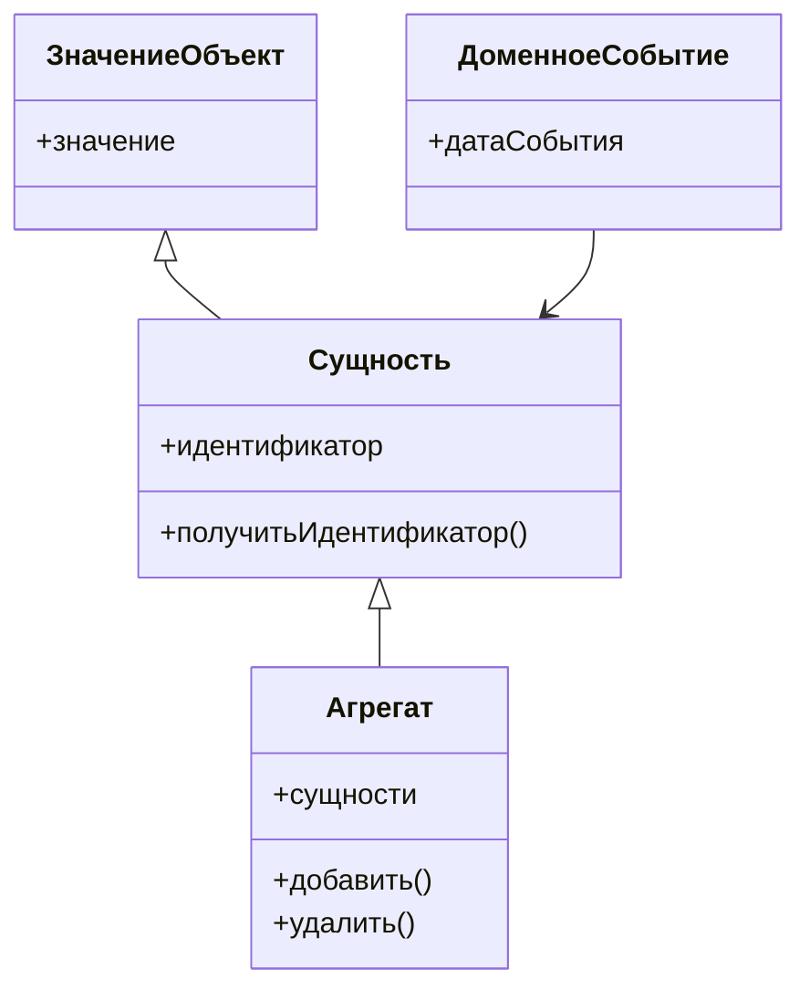
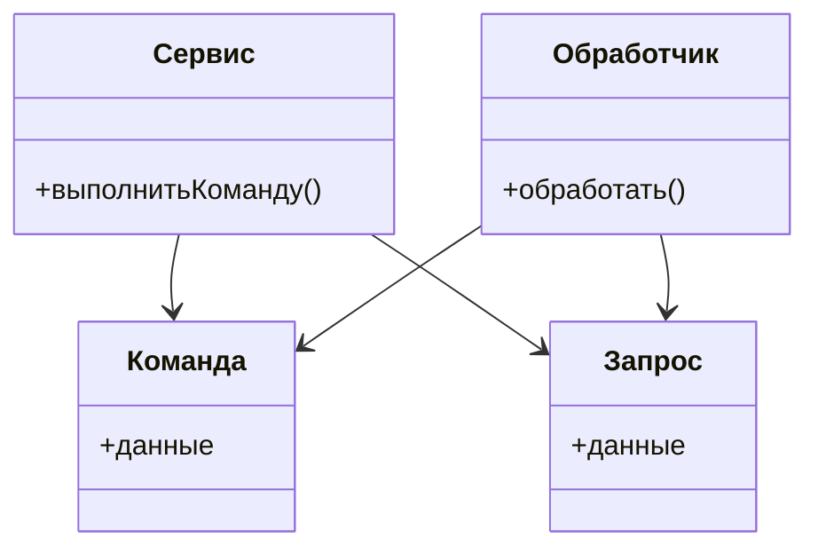

## 1. Перечень библиотек и их назначения

| Библиотека       | Ответственность                                                             | Запрещено размещать внутри                     |
|------------------|---------------------------------------------------------------------------|-----------------------------------------------|
| Domain           | Хранение бизнес-логики, сущностей, правил                                   | Все, что связано с инфраструктурой           |
| Application       | Реализация прикладной логики, управляемая пользователем                    | Прямое взаимодействие с базой данных         |
| Contracts         | Определение DTO, публичных интерфейсов                                      | Реализация бизнес-логики                      |
| Infrastructure    | Работа с технологиями доступа к данным и внешними системами                | Бизнес-логика, обрабатывающая данные         |
| Integration       | Взаимодействие с внешними системами и API                                   | Бизнес-логика, хранящая данные                |
| Presentation      | Взаимодействие с пользовательским интерфейсом и представление данных       | Логика обработки данных, доступ к БД         |
| Shared            | Общие утилиты, расширения, которые могут использоваться в других библиотеках | Специфическая логика других библиотек         |

---

## 2. Правила зависимостей между библиотеками

1. **Направления зависимостей**:
   - Presentation → Application
   - Application → Domain
   - Application → Contracts
   - Infrastructure → Domain (не допускается)
   - Domain → Shared

2. **Правила**:
   - Домен не зависит от инфраструктуры.

3. **Интерфейсы и реализации**:
   - Интерфейсы находятся в Contracts.
   - Реализации находятся в Infrastructure.
   - Это важно для соблюдения принципа инверсии зависимостей.

---

## 3. UML диаграмма пакетов структуры библиотек



---

## 4. UML диаграммы классов для библиотеки Domain



---

## 5. UML диаграммы классов для библиотеки Application



---

## 6. Описание публичных контрактов библиотек

| Библиотека       | Публичный API                      | Ломающие изменения             | Документация                      |
|------------------|------------------------------------|--------------------------------|-------------------------------------|
| Domain           | Сущности, ЗначениеОбъект, Агрегаты | Изменение публичных методов    | Описание каждого элемента API      |
| Application      | Сервисы, Команды, Запросы          | Изменение сигнатур методов     | Примеры использования всех сервисов |
| Contracts        | DTO, Ошибки                        | Изменение структуры DTO       | Документация для всех DTO          |

---

## 7. Тестируемость и изоляция зависимостей

1. **Модульные тесты для Domain**:
   - Проверка инвариантов при добавлении и удалении сущностей.

2. **Изоляция инфраструктуры**:
   - Использование интерфейсов для доступа к данным.
   - Реализация через Dependency Injection.

3. **Интеграционные тесты**:
   - Проверка взаимодействия Application и Infrastructure.
   - Тестирование сценариев запуска и завершения транзакций.

---

## 8. Шаблон структуры репозитория и правила именования

### Дерево каталогов

```
/src
    /Domain
    /Application
    /Contracts
    /Infrastructure
    /Integration
    /Presentation
    /Shared
/docs
/tests
/migrations
```

### Правила именования
- Проекты: Название библиотеки + .Library
- Пространства имен: Название библиотеки + .Namespace
- Классы: Название роли + Имя сущности

### Хранение UML диаграмм
- Хранить в каталоге /docs, связывать с кодом через комментарии на уровне класса.

---

## 9. План сопровождения структуры библиотек

1. **Добавление новых модулей**:
   - Использовать правила зависимостей для предотвращения циклов.

2. **Процесс ревью архитектуры**:
   - Обсуждение изменений на архитектурных встречах, оценка влияния на существующий код.

3. **Критерии выделения библиотеки**:
   - Необходимость хранения логики в отдельной библиотеке при увеличении объема кода или ответственности.